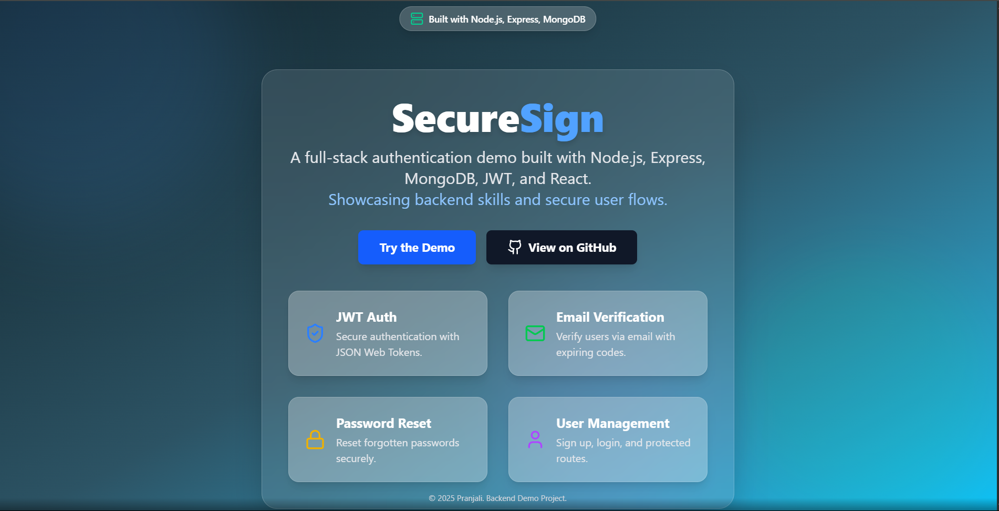

# SecureSign – MERN Authentication 

A modern, full-stack authentication demo built with **Node.js**, **Express**, **MongoDB**, **JWT**, and **React**.
Showcases secure user flows, backend best practices, and a beautiful, interactive UI.



---

## 🚀 Features

- **User Registration & Login**
- **JWT Authentication** (secure, stateless sessions)
- **Email Verification** (with expiring codes)
- **Password Reset** (secure, email-based)
- **Protected Routes** (frontend & backend)
- **Responsive, Modern UI** (React + Tailwind CSS)
- **Mailtrap Integration** for safe email testing
- **Error Handling & Validation** (robust, user-friendly)
- **Clean Code Structure** (easy to extend)

---

## 🛠️ Tech Stack

- **Frontend:** React, Vite, Tailwind CSS, Zustand, Framer Motion
- **Backend:** Node.js, Express, MongoDB (Mongoose), JWT, Mailtrap
- **Other:** dotenv, bcryptjs, cookie-parser, axios

---

## ✨ Demo

**Live Demo:** (https://your-demo-url.com)

---

## 📦 Getting Started

### 1. Clone the Repository

```bash
git clone https://github.com/yourusername/your-repo-name.git
cd your-repo-name
```

### 2. Install Dependencies

```bash
npm install
cd Auth/frontend
npm install
```

### 3. Environment Variables

Create a `.env` file in `Auth/backend/` with the following:

```env
PORT=5000
MONGO_URI=your_mongodb_connection_string
JWT_SECRET=your_super_secret_jwt_key
CLIENT_URL=http://localhost:5173

MAILTRAP_ENDPOINT=https://send.api.mailtrap.io/api/send
MAILTRAP_TOKEN=your_mailtrap_api_token
MAILTRAP_SENDER_EMAIL=your_verified_sender_email@example.com
```

> **Tip:** See the README section “How to get your .env values” for step-by-step instructions.

### 4. Run the App

**In one terminal (backend):**
```bash
npm run dev
```

**In another terminal (frontend):**
```bash
cd Auth/frontend
npm run dev
```

Visit [http://localhost:5173](http://localhost:5173) in your browser.

---

## 📂 Project Structure

```
Auth/
  backend/
    controllers/
    db/
    mailtrap/
    middleware/
    models/
    routes/
    utils/
    index.js
  frontend/
    src/
      assets/
      components/
      pages/
      store/
      utils/
      App.jsx
      main.jsx
      index.css
    public/
    package.json
    tailwind.config.js
    ...
  .gitignore
  README.md
  package.json
```

---

## 🖼️ Screenshots

| Landing Page | Login | Dashboard |
|--------------|-------|-----------|
|  |  |  |

---


## 🙋‍♂️ Author

- **Pranjali ❤️** 

---


